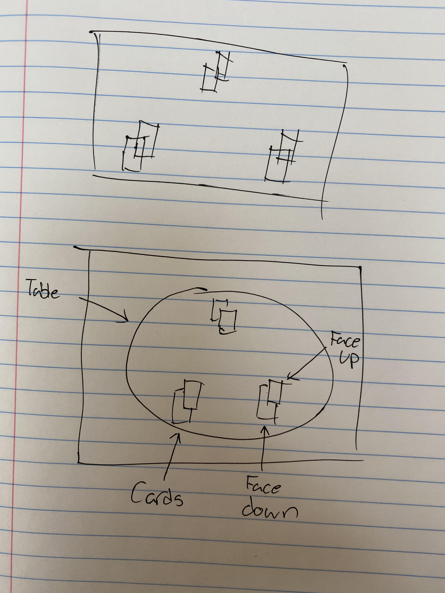

# cs260-startup
**Programming Pair: Kyer Harris and Harrison Cole**

For our project, we are going to create a Blackjack simulator. Blackjack is one of the most popular betting games at the casino. In the game, the players play against the dealer, trying to get cards that equal 21 without going over. It is a relatively simple game but one surprisingly replete with strategy. We will simplify the rules a little bit and add a cheating mode to the game, that will cause the dealer to cheat when possible. We hope to teach people the follies of gambling while also giving them a run for their money (haha). So who's ready to invest?

